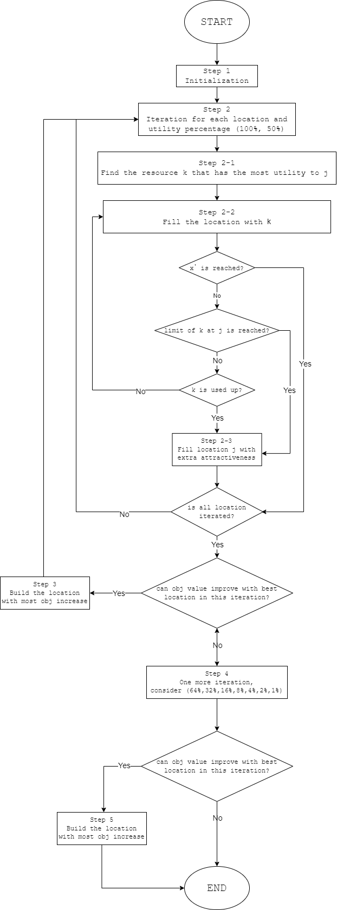

## Module structure

```plaintext
- /Algorithm
- /Instance
- /Model
- utility.py
- config.py
- README.md
- /Images
```


## A Competitive Facility Location Problem with Endogenous Demand and Resources Allocation

The competitive facility location (CFL) problem has been widely discussed for many
years. In a typical facility location problem, decision makers need to determine the
locations of facilities and allocate which users should go to which facilities. However,
when we discuss CFL problems, we find that the utility of each facility for consumers
depends on the resources allocated by decision makers to the facilities and the distance
between the facilities and consumers. In this case, user behavior cannot be forcibly
determined by decision makers; instead, consumers choose facilities based on their utility.
In addition to increasing attractiveness level of facilities by constructing additional
enhancements, decision makers can allocate different limited resources to the facilities.
Different allocations of resources to different facilities result in varying attractiveness,
creating another source of facility and resource heterogeneity. Considering different
resource types in the allocation process makes our problem more realistic.

In our study, we consider a competitive facility location problem with different
resource types, limited quantities for each resource type, and varying resource
attractiveness for different facilities. Decision makers need to determine the locations and
quantities of facilities and allocate resource types to each facility, aiming to attract as
many served users as possible to maximize profit. To solve this problem, we developed a
mixed-integer programming model and a heuristic algorithm. Through numerical
experiments, we observed that our algorithm produces results close to the optimal solution
within an acceptable time frame.


### Greedy Heuristic Algorithm Flow Chart
